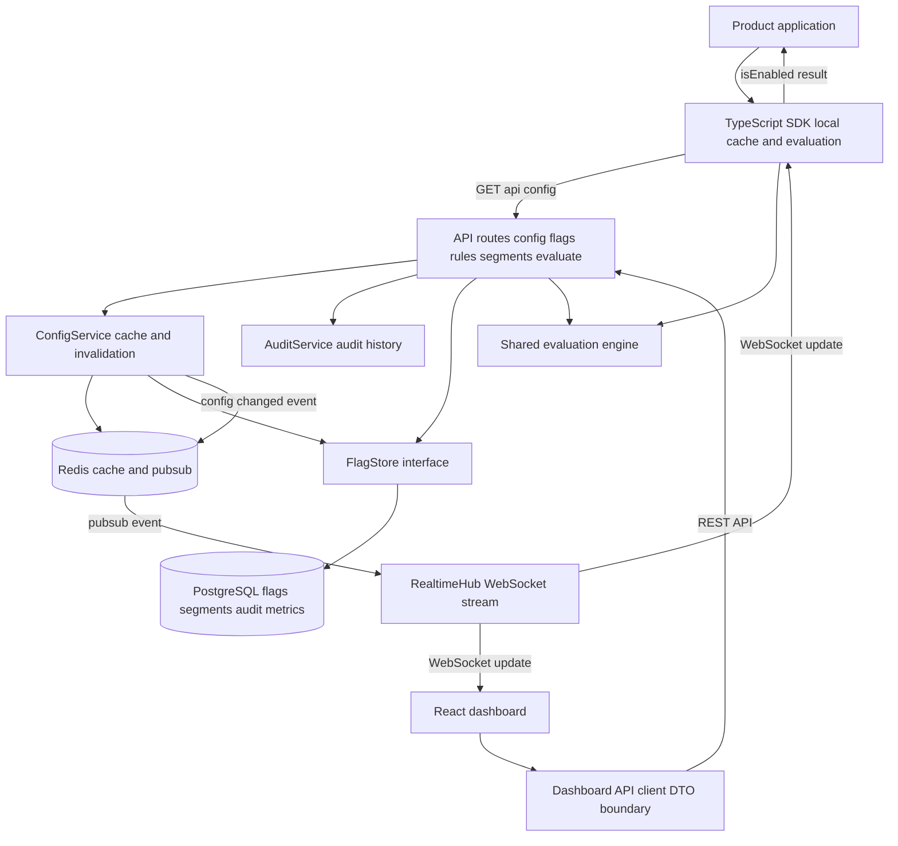

# Architecture

## Components

- Client applications use the TypeScript SDK to read feature flags.
- The SDK downloads project configuration from the API, caches it locally and evaluates flags without a network round trip on every check.
- The React dashboard manages flags, rules, segments, rollbacks, metrics and audit history through its own frontend API client and DTOs.
- The API exposes routes for config, flags, rules, segments, evaluation, metrics and audit.
- `ConfigService` reads configuration through Redis cache first and falls back to the store.
- `AuditService` records configuration changes.
- `FlagStore` abstracts persistence so the API can run with in-memory storage locally or PostgreSQL in Docker.
- Redis is used for config cache and pubsub invalidation.
- WebSocket streaming notifies SDKs and the dashboard when configuration changes.
- The shared package contains the pure flag evaluation engine used by the API and SDK.

## Request Flow

1. The dashboard calls the backend through `apps/dashboard/src/api/client.ts`.
2. API route modules validate input and delegate work to services.
3. Reads go through `ConfigService`, which checks Redis before loading from the store.
4. Mutations update the store, append an audit entry, invalidate cache and publish a `config_changed` event.
5. WebSocket subscribers receive the update and refresh their local config.
6. The SDK evaluates flags locally using cached config and the shared evaluation engine.

## Module Boundaries

- `apps/dashboard`: presentation, frontend DTOs and API client only.
- `apps/api`: HTTP routes, services, storage adapters and realtime infrastructure.
- `packages/shared`: pure evaluation logic and backend/SDK domain types.
- `packages/sdk`: public TypeScript client used by product applications.

## Consistency Model

Writes are durable in PostgreSQL. Cache and SDK clients converge through Redis invalidation and WebSocket updates. If streaming is unavailable, the SDK still refreshes config when its TTL expires.
